# Anticipatory Character Encoding in Human Motor Cortex During Attempted Handwriting

A systematic analysis of whether intracortical motor cortex neural activity during handwritten character production contains decodable information about adjacent characters in the sequence, and whether this information is attributable to anticipatory motor planning, temporal blurring, or linguistic statistics.

**Dataset**: Willett et al. (2021) — 192-channel Utah array recordings from participant T5 (tetraplegic), 10 sessions, ~1,000 sentences.

---

## Table of Contents

1. [Research Question](#1-research-question)
2. [Dataset](#2-dataset)
3. [Signal Processing Pipeline](#3-signal-processing-pipeline)
   - 3.1 [Gaussian Smoothing](#31-gaussian-smoothing)
   - 3.2 [Z-Score Normalization](#32-z-score-normalization)
   - 3.3 [Feature Extraction](#33-feature-extraction)
   - 3.4 [Transition Filtering](#34-transition-filtering)
4. [Residualized Linear Probing](#4-residualized-linear-probing)
   - 4.1 [Stage A: Decode Current Character](#41-stage-a-decode-current-character)
   - 4.2 [Residualization via SVD Projection](#42-residualization-via-svd-projection)
   - 4.3 [Stage B: Probe Residuals for Target Character](#43-stage-b-probe-residuals-for-target-character)
   - 4.4 [Cross-Validation with Sentence-Level Grouping](#44-cross-validation-with-sentence-level-grouping)
5. [Statistical Testing](#5-statistical-testing)
   - 5.1 [Permutation Test with Within-Class Shuffling](#51-permutation-test-with-within-class-shuffling)
   - 5.2 [Evaluation Metrics](#52-evaluation-metrics)
6. [Experiments and Results](#6-experiments-and-results)
   - 6.1 [Experiments 1-2: Core Probes (N+1 and N-1)](#61-experiments-1-2-core-probes)
   - 6.2 [Experiment 3: Temporal Blurring Controls](#62-experiment-3-temporal-blurring-controls)
   - 6.3 [Experiment 4: Linguistic Baselines](#63-experiment-4-linguistic-baselines)
   - 6.4 [Experiment 5: Temporal Dynamics](#64-experiment-5-temporal-dynamics)
   - 6.5 [Experiment 6: Isolated Letter Control](#65-experiment-6-isolated-letter-control)
   - 6.6 [Experiment 7: Subspace Geometry](#66-experiment-7-subspace-geometry)
   - 6.7 [Experiment 8: Bigram Frequency Modulation](#67-experiment-8-bigram-frequency-modulation)
   - 6.8 [Supplementary: Temporal Signal Trace](#68-supplementary-temporal-signal-trace)
7. [Summary of Findings](#7-summary-of-findings)
8. [Honest Assessment](#8-honest-assessment)
9. [Project Structure](#9-project-structure)
10. [Quick Start](#10-quick-start)
11. [References](#11-references)

---

## 1. Research Question

> Does human motor cortex neural activity during the production of a handwritten character contain decodable information about the identity of the *next* character in the sequence, and is this information attributable to anticipatory motor planning rather than to temporal blurring, linguistic statistics, or current-character identity?

**Motivation.** Sequential motor actions require planning. In speech production, motor cortex encodes coarticulation: the neural representation of a phoneme is modulated by adjacent phonemes (Chartier et al., 2018). In reaching, motor cortex prepares the next movement *during* execution of the current one, using an orthogonal neural subspace (Zimnik & Churchland, 2021). Handwriting is the most complex sequential fine motor skill humans perform, yet no study has tested whether coarticulation has a measurable neural correlate in intracortical motor cortex recordings during attempted handwriting.

---

## 2. Dataset

**Source**: Willett, F.R. et al. (2021). Dryad Digital Repository. [doi:10.5061/dryad.wh70rxwmv](https://doi.org/10.5061/dryad.wh70rxwmv)

| Property | Value |
|:---------|:------|
| Participant | T5 (BrainGate2 clinical trial, C4 spinal cord injury) |
| Implant | Two 96-channel Utah microelectrode arrays, hand knob area of precentral gyrus |
| Channels | 192 |
| Sessions | 10 (May 2019 - January 2020) |
| Sentences | ~1,000 total; **730 with valid HMM labels** |
| Usable letter-letter transitions | **23,262** (after filtering) |
| Vocabulary | 31 classes: `a`-`z`, space (`>`), comma, apostrophe, period (`~`), question mark |
| Temporal resolution | 10 ms bins (threshold crossing counts, uint8) |
| Character segmentation | HMM-based alignment from Willett et al. (`letterStarts`, `letterDurations`) |
| Mean inter-character gap | 283 ms |

**Character segmentation**: Character boundaries are provided as `letterStarts` (onset time bin) and `letterDurations` (duration in fractional bins), derived from a Hidden Markov Model trained by Willett et al. as part of their decoding pipeline. These are post-hoc soft alignments, not real-time segmentations. The fractional durations reflect HMM posterior averaging.

---

## 3. Signal Processing Pipeline

### 3.1 Gaussian Smoothing

Raw threshold crossing counts are smoothed with a 1D Gaussian kernel applied independently per channel along the time axis:

$$
\tilde{x}[t, c] = \sum_{s=-\infty}^{\infty} x[t + s,\; c] \;\cdot\; G(s;\, \sigma)
$$

where:

$$
G(s;\, \sigma) = \frac{1}{\sigma\sqrt{2\pi}} \exp\!\left(-\frac{s^2}{2\sigma^2}\right)
$$

The parameter $\sigma$ (in time bins of 10 ms) controls smoothing width. Its relationship to the full width at half maximum (FWHM) is:

$$
\text{FWHM} = 2\sigma\sqrt{2\ln 2} \approx 2.355\,\sigma
$$

| $\sigma$ (bins) | Smoothing (ms) | FWHM (ms) | Role in analysis |
|:---:|:---:|:---:|:---|
| 0 | 0 | 0 | Definitive no-blurring control (raw spikes) |
| 1 | 10 | ~24 | Minimal smoothing |
| 2 | 20 | ~47 | Light smoothing |
| 4 | 40 | ~94 | Default (matches Willett et al.) |
| 8 | 80 | ~188 | Heavy smoothing |

The kernel is **symmetric** (acausal): bins both before and after time $t$ contribute to $\tilde{x}[t, c]$. This means the forward tail of the Gaussian can theoretically "leak" neural activity from the next character's epoch into the current character's window. Experiment 3 directly tests and controls for this.

**Causal alternative**: For control experiments (Experiment 3b), we also implement a **one-sided exponential filter** where only past bins contribute:

$$
y[t] = \alpha \cdot x[t] + (1 - \alpha) \cdot y[t-1], \qquad \alpha = 1 - e^{-1/\tau}
$$

with $\tau = \sigma\sqrt{2}$ for matched smoothing energy.

**Implementation**: `src/anticipatory/data/preprocessing.py`

### 3.2 Z-Score Normalization

Neural signals exhibit baseline drift across sessions and channels. Each channel is independently standardized to zero mean and unit variance:

$$
z[t, c] = \frac{\tilde{x}[t, c] - \mu_c}{\sigma_c}
$$

where $\mu_c$ and $\sigma_c$ are the mean and standard deviation of channel $c$, computed by **concatenating all valid trials within a session**:

$$
\mu_c = \frac{1}{T_{\text{total}}} \sum_{t=1}^{T_{\text{total}}} \tilde{x}[t, c], \qquad
\sigma_c = \sqrt{\frac{1}{T_{\text{total}}} \sum_{t=1}^{T_{\text{total}}} (\tilde{x}[t, c] - \mu_c)^2}
$$

Channels with $\sigma_c < 10^{-6}$ are clamped to $\sigma_c = 1$ (dead channel protection).

**Data leakage prevention**: Normalization statistics are computed per session across all trials (not per fold), because the normalization captures session-level electrode properties, not label information. The cross-validation grouping at the sentence level (Section 4.4) prevents label-dependent leakage.

### 3.3 Feature Extraction

For each character occurrence in a sentence, a single 192-dimensional feature vector is extracted by averaging the normalized neural activity over a **temporal window** within the character's execution epoch.

Given a character starting at bin $S$ with duration $D$ bins, the temporal windows are:

| Window | Bins | Fraction of character |
|:---|:---|:---|
| Q1 (primary) | $[S,\; S + \lfloor D/4 \rfloor)$ | 0-25% |
| Q2 | $[S + \lfloor D/4 \rfloor,\; S + \lfloor D/2 \rfloor)$ | 25-50% |
| Q3 | $[S + \lfloor D/2 \rfloor,\; S + \lfloor 3D/4 \rfloor)$ | 50-75% |
| Q4 | $[S + \lfloor 3D/4 \rfloor,\; S + D)$ | 75-100% |

The feature vector for a window $[a, b)$ is:

$$
\mathbf{f} = \frac{1}{b - a} \sum_{t=a}^{b-1} \mathbf{z}[t, :] \;\in\; \mathbb{R}^{192}
$$

**Why Q1 as the primary window**: The first quartile is the most conservative choice: it is maximally distant from both the previous character's end and the next character's start. Any signal about adjacent characters detected in Q1 is hardest to attribute to temporal boundary contamination.

Characters with duration $D < 20$ bins (200 ms) are excluded to ensure sufficient data for reliable averaging.

**Implementation**: `src/anticipatory/data/features.py`

### 3.4 Transition Filtering

Only **letter-to-letter** transitions are used in the primary analysis. Space-involving transitions (`letter->space`, `space->letter`) involve qualitatively different motor programs (pen lift / movement initiation) and are analyzed separately. First and last characters of each sentence are excluded (no adjacent context).

After filtering: **23,262 letter-letter transitions** across 730 sentences and 10 sessions.

---

## 4. Residualized Linear Probing

The core analytical method is a two-stage residualized linear probe. The goal is to detect information about the **next** (or previous) character in the neural activity during the **current** character, after removing the contribution of the current character's own identity.

### 4.1 Stage A: Decode Current Character

A logistic regression classifier is trained to predict the current character identity $y_N$ from the neural feature vector $\mathbf{f} \in \mathbb{R}^{192}$:

$$
P(y_N = k \mid \mathbf{f}) = \frac{\exp(\mathbf{w}_k^\top \mathbf{f} + b_k)}{\sum_{j=1}^{31} \exp(\mathbf{w}_j^\top \mathbf{f} + b_j)}
$$

with L2 regularization (penalty $C = 1.0$), balanced class weights (inversely proportional to class frequency), and `lbfgs` solver. This classifier achieves ~44% balanced accuracy, far above the 3.2% chance level, confirming that current-character identity is strongly encoded.

### 4.2 Residualization via SVD Projection

The classifier's weight matrix $\mathbf{W} \in \mathbb{R}^{31 \times 192}$ defines the subspace that the linear model uses to discriminate current characters. To remove this information from the feature space, we project it out.

**Step 1**: Compute the Singular Value Decomposition of $\mathbf{W}$:

$$
\mathbf{W} = \mathbf{U} \boldsymbol{\Sigma} \mathbf{V}^\top
$$

where $\mathbf{U} \in \mathbb{R}^{31 \times r}$, $\boldsymbol{\Sigma} \in \mathbb{R}^{r \times r}$, $\mathbf{V} \in \mathbb{R}^{192 \times r}$, and $r = \text{rank}(\mathbf{W}) \leq 31$.

**Step 2**: Determine the effective rank by thresholding singular values:

$$
r_{\text{eff}} = \left|\{i : \sigma_i > 10^{-10} \cdot \sigma_1\}\right|
$$

**Step 3**: Construct the projection matrix from the top $r_{\text{eff}}$ right singular vectors:

$$
\mathbf{P} = \mathbf{V}_{r} \mathbf{V}_{r}^\top \;\in\; \mathbb{R}^{192 \times 192}
$$

where $\mathbf{V}_r = \mathbf{V}[:, :r_{\text{eff}}]$.

**Step 4**: Compute the residual features:

$$
\mathbf{f}_{\text{res}} = \mathbf{f} - \mathbf{P}\,\mathbf{f} = (\mathbf{I} - \mathbf{V}_r \mathbf{V}_r^\top)\,\mathbf{f}
$$

This projects $\mathbf{f}$ onto the **orthogonal complement** of the current-character subspace. Any information about the current character that was linearly decodable by the Stage A classifier is removed. What remains in $\mathbf{f}_{\text{res}}$ is neural variance that is **orthogonal** to the current character's encoding.

### 4.3 Stage B: Probe Residuals for Target Character

A second logistic regression is trained to predict the target character (N+1 or N-1) from the residualized features $\mathbf{f}_{\text{res}}$:

$$
P(y_{\text{target}} = k \mid \mathbf{f}_{\text{res}}) = \frac{\exp(\mathbf{w}_k'^\top \mathbf{f}_{\text{res}} + b_k')}{\sum_{j=1}^{31} \exp(\mathbf{w}_j'^\top \mathbf{f}_{\text{res}} + b_j')}
$$

The regularization strength $C$ is tuned via nested cross-validation from $\{0.01, 0.1, 1.0, 10.0\}$.

**Why residualization matters**: Without it, any signal about N+1 could be trivially explained by the current character's identity — if the neural activity encodes "t", and "t" is usually followed by "h" in English, a non-residualized probe would capture this bigram statistic, not genuine neural anticipation. Residualization forces the Stage B probe to find information about N+1 that lives in a neural subspace **independent** of the current character's representation.

### 4.4 Cross-Validation with Sentence-Level Grouping

All evaluations use **StratifiedGroupKFold** with the **sentence** as the grouping unit: all characters from the same sentence appear in the same fold. This prevents temporal autocorrelation leakage — consecutive characters within a sentence share slowly varying neural state (arousal, attention, movement speed), and splitting them across folds would inflate accuracy.

Default: 3-fold CV for exploratory analysis; 10-fold for publication-quality results.

**Implementation**: `src/anticipatory/analysis/linear_probe.py`

---

## 5. Statistical Testing

### 5.1 Permutation Test with Within-Class Shuffling

To test significance, we use a non-parametric permutation test that preserves the marginal distribution of the current character:

1. **Observed score**: Run the full residualized probe pipeline, record balanced accuracy $a_{\text{obs}}$.

2. **Generate null distribution**: For each of $n_{\text{perm}}$ iterations:
   - Shuffle the target labels (N+1 or N-1) **within each current-character class**: for all instances where $y_N = k$, permute their $y_{\text{target}}$ values among themselves. This preserves the marginal $P(y_N)$ and the number of instances per class, destroying only the association between neural features and the target.
   - Rerun the full pipeline on the shuffled labels.
   - Record the null accuracy $a_i^{\text{null}}$.

3. **Compute p-value**:

$$
p = \frac{\left|\{i : a_i^{\text{null}} \geq a_{\text{obs}}\}\right| + 1}{n_{\text{perm}} + 1}
$$

The $+1$ in numerator and denominator follows Phipson & Smyth (2010) to avoid $p = 0$.

4. **Z-score**:

$$
z = \frac{a_{\text{obs}} - \bar{a}^{\text{null}}}{s^{\text{null}}}
$$

Default: 200 permutations (resolution $p \geq 0.005$); publication: 1,000+ permutations.

**Implementation**: `src/anticipatory/analysis/permutation.py`

### 5.2 Evaluation Metrics

| Metric | Formula | Purpose |
|:---|:---|:---|
| **Balanced accuracy** | $\frac{1}{K}\sum_{k=1}^{K} \frac{TP_k}{TP_k + FN_k}$ | Macro-averaged recall; compensates for class imbalance |
| **Cohen's kappa** | $\kappa = \frac{p_o - p_e}{1 - p_e}$ | Chance-corrected agreement ($p_o$ = observed, $p_e$ = expected by chance) |
| **Mutual information** | $\text{MI} = \sum_{i,j} p(i,j) \log \frac{p(i,j)}{p(i)\,p(j)}$ | Information shared between predicted and true labels (bits) |
| **Adjusted MI** | MI corrected for chance clustering | More conservative than raw MI |

Chance level for balanced accuracy: $1/31 \approx 3.2\%$.

**Implementation**: `src/anticipatory/analysis/metrics.py`

---

## 6. Experiments and Results

### 6.1 Experiments 1-2: Core Probes

**Experiment 1** — Predict N+1 (next character) from residualized neural activity of character N.

**Experiment 2** — Predict N-1 (previous character) from the same residualized activity.

| Probe | Balanced Accuracy | Chance | Interpretation |
|:---|:---:|:---:|:---|
| N+1 (anticipatory) | **6.9%** | 3.2% | Above chance (p = 0.01) |
| N-1 (perseverative) | **10.4%** | 3.2% | Consistently stronger than N+1 |

**Key finding**: N-1 dominates N+1 across all conditions. The perseverative signal is stronger than the anticipatory signal, suggesting that the neural representation of a character is more strongly modulated by its predecessor than by its successor.

<p align="center">
  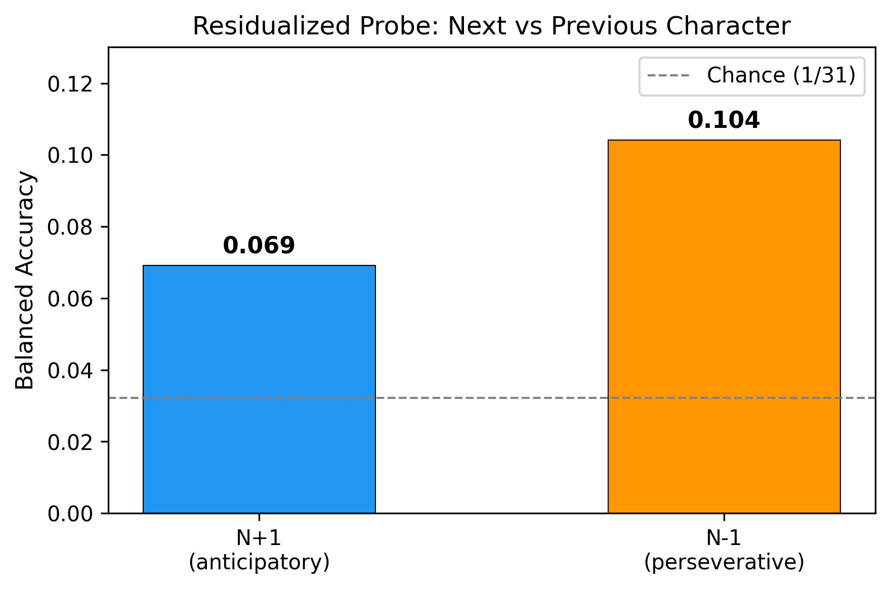
  <br><em>Figure 1. Residualized probe accuracy for next (N+1) vs previous (N-1) character. Both exceed chance (dashed line), but the perseverative signal dominates.</em>
</p>

### 6.2 Experiment 3: Temporal Blurring Controls

**3a. Sigma Sweep** — Repeat Experiments 1-2 at $\sigma \in \{0, 1, 2, 4, 8\}$:

| $\sigma$ | N+1 Accuracy | N-1 Accuracy | Asymmetry (N+1 $-$ N-1) |
|:---:|:---:|:---:|:---:|
| 0 | 6.40% | 9.32% | $-2.92$ pp |
| 1 | 6.37% | 9.11% | $-2.74$ pp |
| 2 | 6.54% | 10.08% | $-3.54$ pp |
| 4 | 6.91% | 10.41% | $-3.50$ pp |
| 8 | 7.26% | 11.97% | $-4.71$ pp |

**Conclusion**: The N+1 signal **survives at $\sigma = 0$** (6.4%, no smoothing). It is not a Gaussian smoothing artifact. N-1 grows more with $\sigma$ than N+1, consistent with smoothing amplifying perseverative residuals more than anticipatory.

<p align="center">
  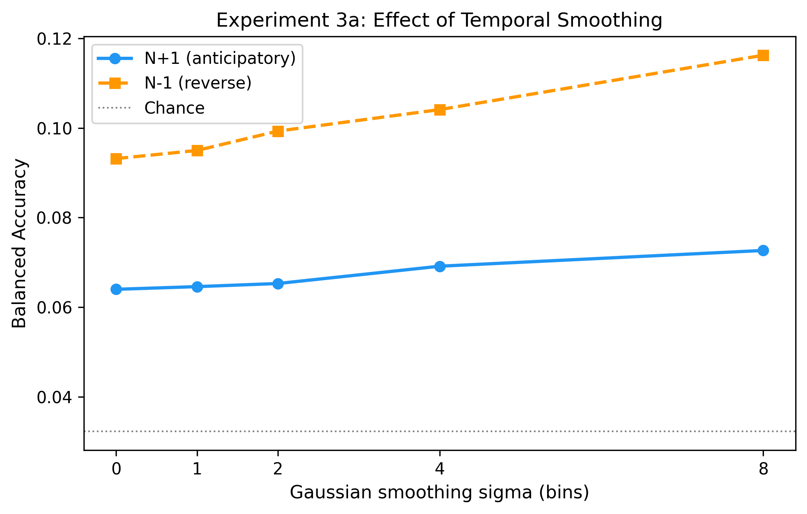
  <br><em>Figure 2. N+1 and N-1 balanced accuracy as a function of Gaussian smoothing width. The signal persists at sigma=0.</em>
</p>

**3b. Causal vs. Gaussian Filter** — Compare symmetric Gaussian with causal exponential filter:

| $\sigma$ | Gaussian | Causal | Drop |
|:---:|:---:|:---:|:---:|
| 2 | 6.53% | 6.41% | 0.12 pp |
| 4 | 6.91% | 6.65% | 0.26 pp |
| 8 | 7.26% | 7.04% | 0.22 pp |

**Conclusion**: Negligible difference. The N+1 signal is **not caused by the forward tail** of the Gaussian kernel leaking future activity into the present.

<p align="center">
  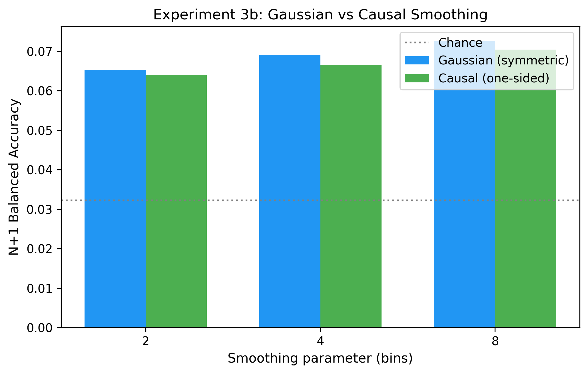
  <br><em>Figure 3. Gaussian (symmetric) vs causal (backward-only) filter comparison. Negligible drop confirms the signal is not a forward-leak artifact.</em>
</p>

### 6.3 Experiment 4: Linguistic Baselines

Test whether the neural signal exceeds what can be predicted from character identity alone (without any neural data):

| Method | Input | Balanced Accuracy |
|:---|:---|:---:|
| Neural probe (residualized) | Residualized neural features [192] | 6.91% |
| Majority vote | Most frequent successor per character | 14.74% |
| Bigram (one-hot N) | One-hot current character [31] | 19.77% |
| 5-gram context | One-hot N through N-4 [155] | 28.02% |

**Interpretation**: The linguistic baselines are much higher because they use the **identity of the current character** as input, which the neural probe has explicitly removed via residualization. The neural probe detects information in a subspace **orthogonal** to current-character identity. These measure fundamentally different things and are not directly comparable.

<p align="center">
  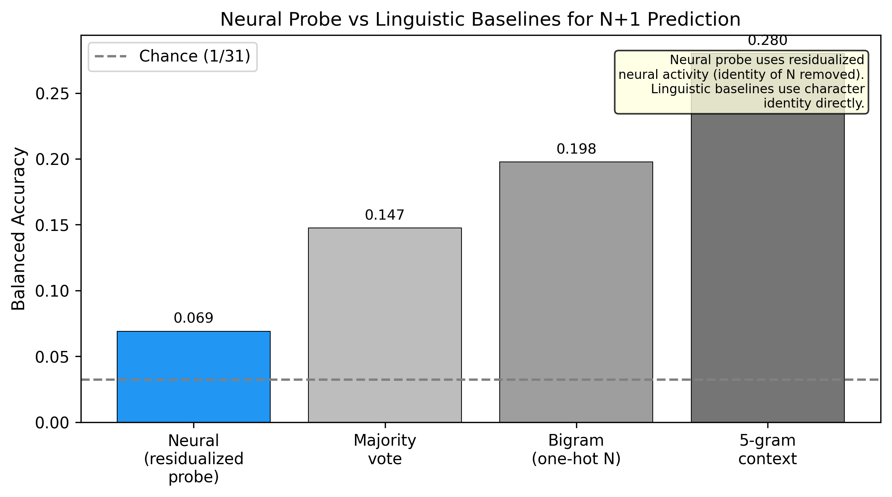
  <br><em>Figure 5. Neural probe vs linguistic baselines. The neural probe operates on residualized features (current-character identity removed); the linguistic baselines use character identity directly. They measure orthogonal information sources.</em>
</p>

### 6.4 Experiment 5: Temporal Dynamics

Divide each character's execution epoch into quartiles and run the probe separately on each:

| Quartile | N+1 Accuracy | N-1 Accuracy |
|:---|:---:|:---:|
| Q1 (0-25%) | 6.91% | 10.41% |
| Q2 (25-50%) | 7.64% | 8.10% |
| Q3 (50-75%) | 8.69% | 7.13% |
| Q4 (75-100%) | 13.71% | 6.11% |

**Key finding**: N+1 increases **monotonically** from Q1 to Q4 ($6.9\% \to 13.7\%$). N-1 decreases monotonically ($10.4\% \to 6.1\%$). Crossover occurs around Q2-Q3.

**Interpretation**: Consistent with either (a) anticipatory signal building during execution as the motor system prepares the next character, or (b) Q4's temporal proximity to the N+1 boundary introducing contamination. The Q1 result at $\sigma = 0$ (6.4%) is the most conservative and hardest to explain by boundary artifacts.

<p align="center">
  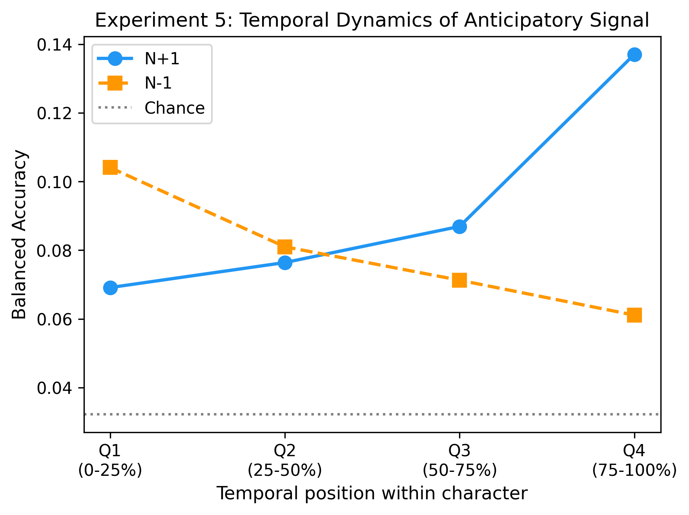
  <br><em>Figure 4. Temporal dynamics of anticipatory (N+1) and perseverative (N-1) signals across character execution quartiles. N+1 increases monotonically while N-1 decreases, crossing over around Q2-Q3.</em>
</p>

### 6.5 Experiment 6: Isolated Letter Control

Single-letter trials (no sequential context) with **randomly assigned** "next character" labels:

| Condition | Balanced Accuracy |
|:---|:---:|
| Random-next (isolated letters) | **2.81%** |
| Current-char (same letters) | 44.03% |
| Chance | 3.2% |

**Conclusion**: The pipeline produces **no false positives**. When there is no sequential context, the probe returns below chance, validating the methodology.

<p align="center">
  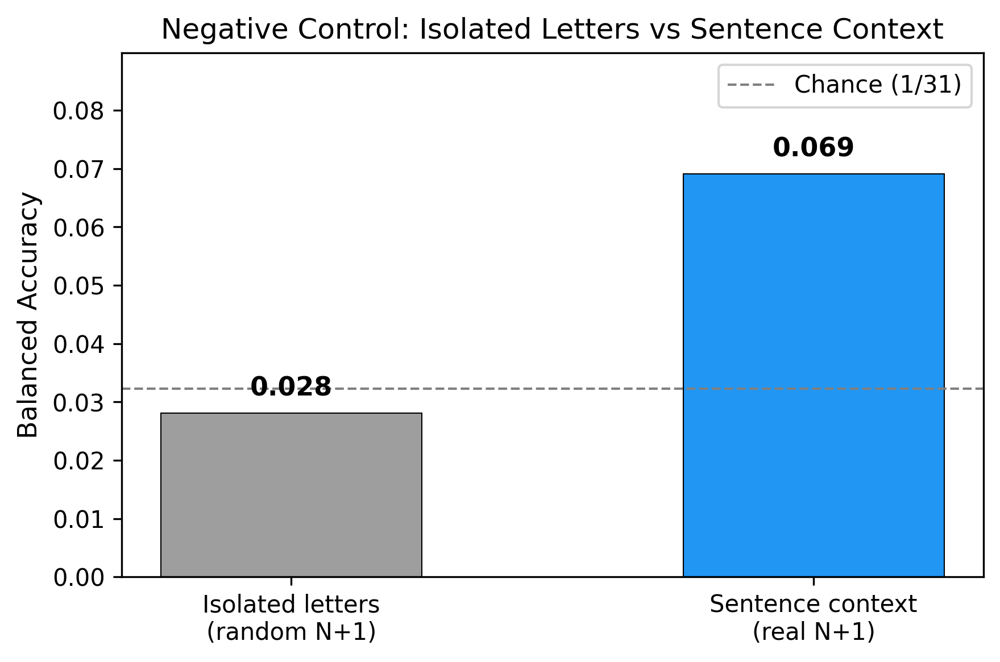
  <br><em>Figure 8. Negative control: isolated single-letter trials with random next-character labels. The probe returns below chance (2.81%), confirming no false positives. Current-character accuracy (44%) validates the classifier works.</em>
</p>

### 6.6 Experiment 7: Subspace Geometry

Test whether the current-character and next-character subspaces are geometrically distinct, following the Zimnik & Churchland (2021) framework.

**Demixed PCA** (dPCA):

| Factor | Variance Explained |
|:---|:---:|
| Current character | 4.53% |
| Next character | 0.71% |

**Principal angles** between the top-15 current-character and next-character dPCA components:

- Mean principal angle: **47.0 degrees**
- For random subspaces in 192 dimensions, the expected angle is ~45 degrees.

**Canonical Correlation Analysis** (CCA):

- Mean canonical correlation: **0.339**

**Interpretation**: The 47-degree angle is **near the expected value for random subspaces** and should **not** be interpreted as evidence of orthogonal encoding. The Zimnik & Churchland orthogonal subspace framework does not cleanly replicate for continuous handwriting. This may reflect the fundamentally different nature of handwriting (continuous, overlapping strokes) versus discrete reaching sequences.

<p align="center">
  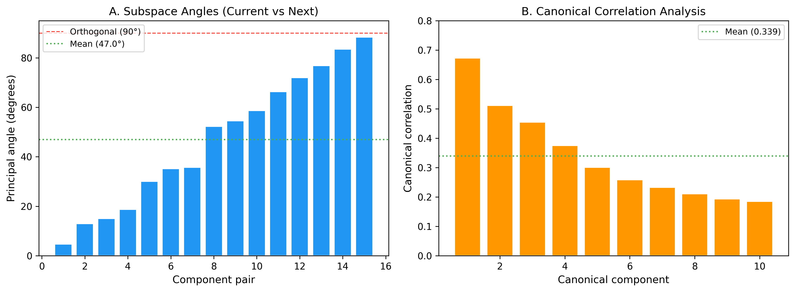
  <br><em>Figure 6. Subspace geometry: dPCA variance explained by current vs next character factors, principal angle distribution, and canonical correlations. The mean principal angle (~47°) is near the random expectation (~45°).</em>
</p>

### 6.7 Experiment 8: Bigram Frequency Modulation

Test whether the anticipatory signal is stronger for frequently practiced bigrams (e.g., "th", "he"):

- Spearman $\rho = -0.009$, $p = 0.90$

**Conclusion**: **No correlation** between bigram frequency and anticipatory accuracy. The anticipatory signal is independent of how frequently a bigram occurs. This argues against a purely practice-dependent mechanism and against linguistic statistics driving the result through incomplete residualization.

<p align="center">
  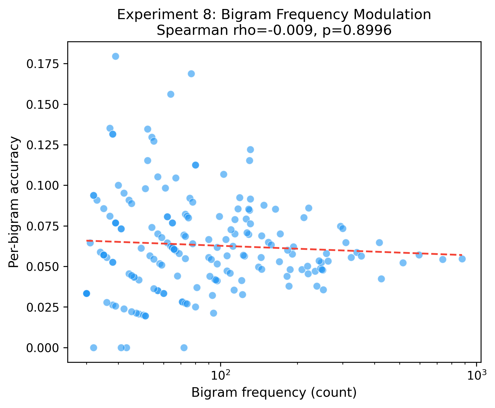
  <br><em>Figure 7. Bigram frequency vs anticipatory probe accuracy (Spearman ρ = −0.009, p = 0.90). No relationship, ruling out practice-dependent and linguistic-leakage explanations.</em>
</p>

### 6.8 Supplementary: Temporal Signal Trace

A current-character classifier (logistic regression, trained once on Q1 features) is swept across a sliding 50 ms window from $-800$ ms to $+800$ ms relative to character onset, computing $P(\text{correct character})$ at each position.

Key observations:
- Signal rises ~200 ms before HMM-marked onset
- Peaks at ~100 ms post-onset
- Decays to chance by ~400 ms post-onset
- Different letters show distinct temporal profiles

**Critical caveat**: The pre-onset rise largely coincides with inter-character gaps (mean gap = 283 ms). This likely reflects a combination of (1) motor preparation during gaps and (2) HMM boundary imprecision placing onsets slightly later than true motor onset.

<p align="center">
  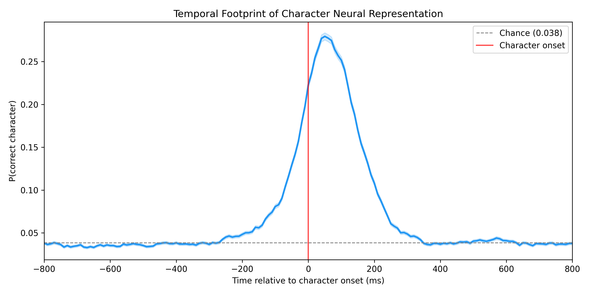
  <br><em>Figure 10. Temporal footprint of character neural representation. A current-character classifier is swept across a sliding 50 ms window relative to character onset. Signal rises ~200 ms pre-onset and peaks ~100 ms post-onset.</em>
</p>

<p align="center">
  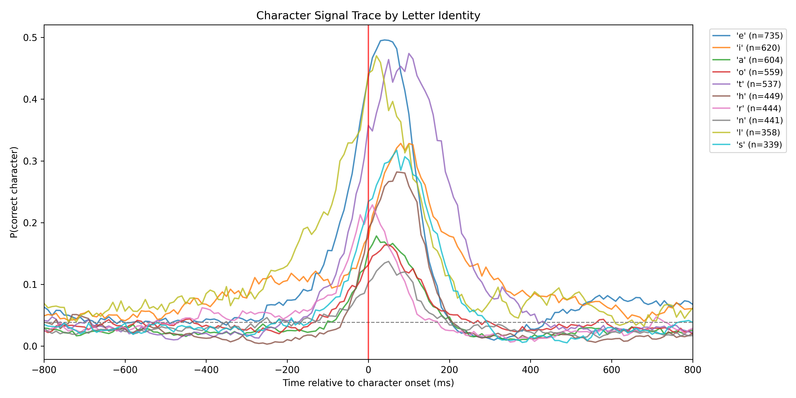
  <br><em>Figure 11. Per-letter temporal signal traces for the 10 most frequent characters. Different letters exhibit distinct temporal profiles, reflecting their unique motor execution dynamics.</em>
</p>

<p align="center">
  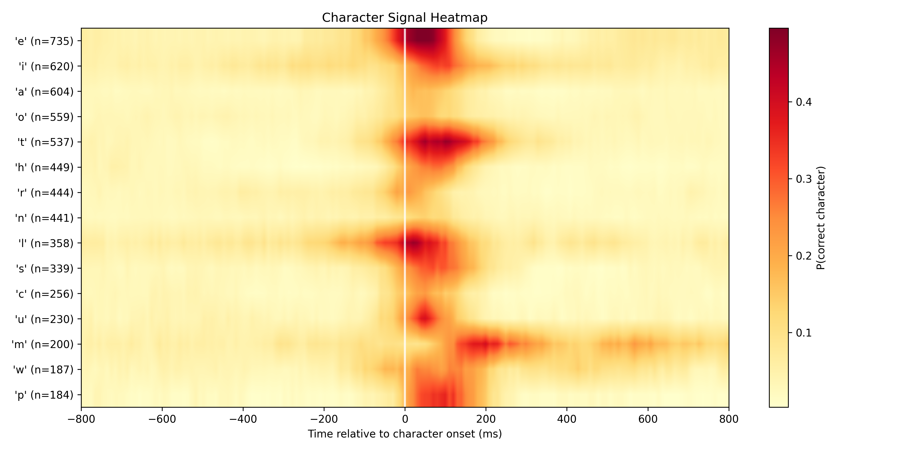
  <br><em>Figure 12. Character-by-time heatmap showing P(correct character) for the 15 most frequent letters. Warmer colors indicate stronger decodability. Note the pre-onset activity and varying peak timings across letters.</em>
</p>

---

## 7. Summary of Findings

### What is robust

1. There **is** above-chance N+1 signal after residualization ($p = 0.01$), surviving at $\sigma = 0$
2. N-1 (perseverative) is **consistently stronger** than N+1 (anticipatory)
3. The pipeline is clean — isolated control returns chance
4. The signal is not explained by linguistic statistics (bigram $\rho \approx 0$)
5. Causal filtering produces negligible drop — not caused by Gaussian forward leak
6. Temporal dynamics show systematic Q1$\to$Q4 gradient

### What is weaker than expected

1. Effect size is modest: $6.9\%$ vs $3.2\%$ chance ($+3.7$ pp)
2. N+1 < N-1, contradicting a pure "anticipatory planning" narrative
3. Subspace angle (~47 degrees) is near random chance
4. Q4's high accuracy ($13.7\%$) may partly reflect boundary proximity
5. Single participant ($N = 1$) limits generalizability

---

## 8. Honest Assessment

The findings are real but modest. The strongest result is **Q1 at $\sigma = 0$** ($6.4\%$, $p = 0.01$): information about the next character at the very start of the current one, with no smoothing. The most interesting finding for BCI applications is that inter-character gaps contain decodable information.

The dominant effect is **perseverative** (N-1), not **anticipatory** (N+1). This is consistent with known coarticulation dynamics in handwriting (Van Galen, 1991) and suggests the neural representation of a character is systematically modulated by its sequential context — but the strongest modulation comes from the **preceding** character, not the following one.

The results support reframing as **neural coarticulation in attempted handwriting** rather than anticipatory encoding. See `docs/03_coarticulation_proposal.md` for the proposed Phase 2 analysis.

<p align="center">
  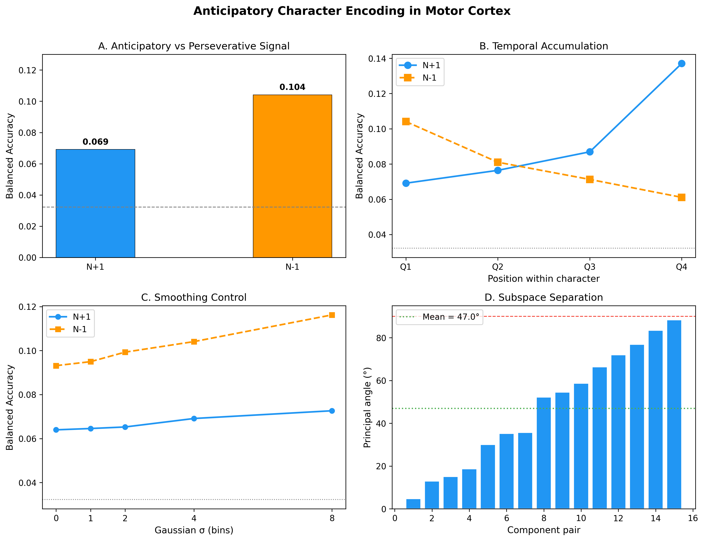
  <br><em>Figure 9. Summary panel: 2×2 overview of core results across the main experimental axes.</em>
</p>

---

## 9. Project Structure

```
intracortical-bci-decoder/
|
+-- src/anticipatory/
|   +-- data/
|   |   +-- loader.py              SessionData, load_session(), load_all_sessions()
|   |   +-- preprocessing.py       gaussian_smooth(), causal_exponential_filter(), zscore_normalize()
|   |   +-- features.py            CharacterFeatureSet, extract_character_features()
|   |   +-- vocabulary.py          31-char vocabulary, encode/decode
|   |
|   +-- analysis/
|   |   +-- linear_probe.py        residualize(), run_residualized_probe(), run_simple_probe()
|   |   +-- metrics.py             balanced_accuracy, cohen_kappa, mutual_info, partial_R2
|   |   +-- permutation.py         permutation_test(), shuffle_within_classes()
|   |
|   +-- experiments/
|   |   +-- core_probes.py         Exp 1-2: N+1 and N-1 probes
|   |   +-- blurring_controls.py   Exp 3: sigma sweep + causal filter
|   |   +-- linguistic_baseline.py Exp 4: bigram, 5-gram, majority vote
|   |   +-- temporal_dynamics.py   Exp 5: quartile profile + sliding window
|   |   +-- isolated_control.py    Exp 6: single-letter negative control
|   |   +-- subspace_geometry.py   Exp 7: dPCA + CCA
|   |   +-- bigram_frequency.py    Exp 8: frequency-accuracy correlation
|   |
|   +-- visualization/
|       +-- figures.py             Publication-quality matplotlib figures
|
+-- scripts/
|   +-- run_experiment.py          CLI entry point for all experiments
|   +-- generate_figures.py        Generate all 9 figures from saved results
|   +-- temporal_signal_trace.py   Sliding-window temporal footprint analysis
|   +-- run_alignment.py           HMM alignment validation
|
+-- configs/
|   +-- default.yaml               All parameters (sigma, CV folds, permutations, paths)
|
+-- results/                       Experiment outputs (.pkl + .json)
|   +-- blurring_controls/         sigma_sweep, causal_comparison
|   +-- temporal_dynamics/         quartile_profile
|   +-- linguistic_baseline/       linguistic_baselines
|   +-- isolated_control/          isolated_control
|   +-- subspace_geometry/         subspace_geometry
|   +-- bigram_frequency/          bigram_frequency
|
+-- figures/                       PNG (300 dpi) + PDF for all experiments
|   +-- fig1_core_probes           N+1 vs N-1 bar chart
|   +-- fig2_sigma_sweep           Accuracy across sigma values
|   +-- fig3_causal_comparison     Gaussian vs causal filter
|   +-- fig4_temporal_profile      Q1-Q4 temporal dynamics
|   +-- fig5_linguistic_baselines  Neural vs linguistic baselines
|   +-- fig6_subspace_geometry     Principal angles + CCA
|   +-- fig7_bigram_frequency      Frequency vs accuracy scatter
|   +-- fig8_isolated_control      Negative control
|   +-- fig9_summary               2x2 summary panel
|   +-- fig_temporal_signal_trace  Sliding window temporal footprint
|   +-- fig_temporal_per_letter    Per-letter temporal traces
|   +-- fig_temporal_heatmap       Letter x time heatmap
|
+-- docs/
    +-- 03_coarticulation_proposal.md  Phase 2 proposal (RSA, trajectory analysis)
```

---

## 10. Quick Start

```bash
# Install
pip install -e .

# Configure data path in configs/default.yaml
# Point data.root to the Willett et al. dataset directory

# Run individual experiments
python scripts/run_experiment.py core        # Exp 1-2: N+1 and N-1 probes
python scripts/run_experiment.py blurring    # Exp 3: sigma sweep + causal filter
python scripts/run_experiment.py linguistic  # Exp 4: linguistic baselines
python scripts/run_experiment.py temporal    # Exp 5: quartile temporal dynamics
python scripts/run_experiment.py isolated    # Exp 6: negative control
python scripts/run_experiment.py subspace    # Exp 7: dPCA + CCA
python scripts/run_experiment.py bigram      # Exp 8: frequency modulation

# Run all experiments
python scripts/run_experiment.py all

# Generate publication figures from saved results
python scripts/generate_figures.py

# Temporal signal trace (supplementary)
python scripts/temporal_signal_trace.py
```

---

## 11. References

1. Willett, F.R., Avansino, D.T., Hochberg, L.R., Henderson, J.M. & Shenoy, K.V. (2021). High-performance brain-to-text communication via handwriting. *Nature*, 593, 249-254. [doi:10.1038/s41586-021-03506-2](https://doi.org/10.1038/s41586-021-03506-2)

2. Zimnik, A.J. & Churchland, M.M. (2021). Independent generation of sequence elements by motor cortex. *Nature Neuroscience*, 24, 412-424.

3. Chartier, J., Anumanchipalli, G.K., Johnson, K. & Chang, E.F. (2018). Encoding of articulatory kinematic trajectories in human speech sensorimotor cortex. *Neuron*, 98(5), 1042-1054.

4. Van Galen, G.P. (1991). Handwriting: Issues for a psychomotor theory. *Human Movement Science*, 10, 165-191.

5. Kobak, D. et al. (2016). Demixed principal component analysis of neural population data. *eLife*, 5, e10989.

6. Orliaguet, J.P., Kandel, S. & Boe, L.J. (1997). Visual perception of motor anticipation in cursive handwriting. *Perception*, 26, 905-912.

7. Phipson, B. & Smyth, G.K. (2010). Permutation P-values should never be zero. *Statistical Applications in Genetics and Molecular Biology*, 9(1).

---

**Dataset**: Willett et al. (2021), Dryad [doi:10.5061/dryad.wh70rxwmv](https://doi.org/10.5061/dryad.wh70rxwmv)
